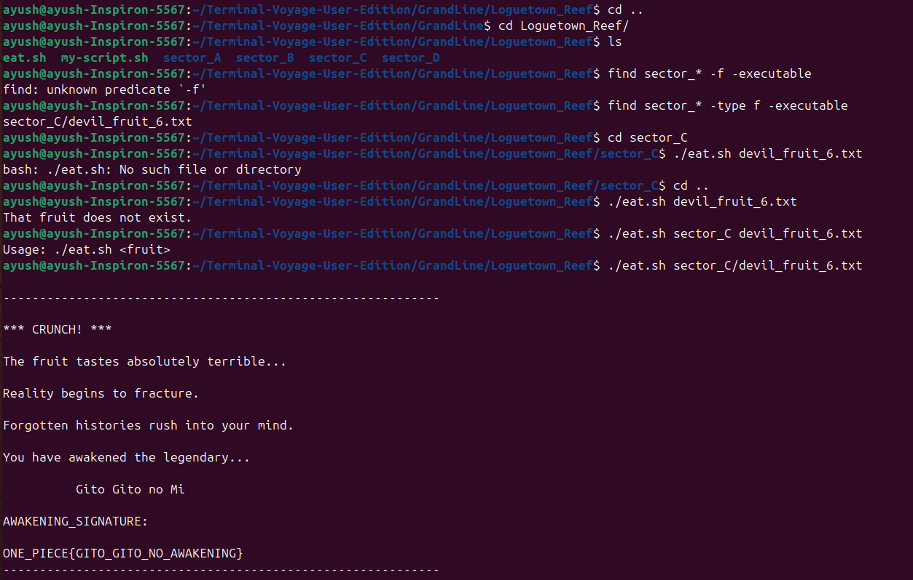
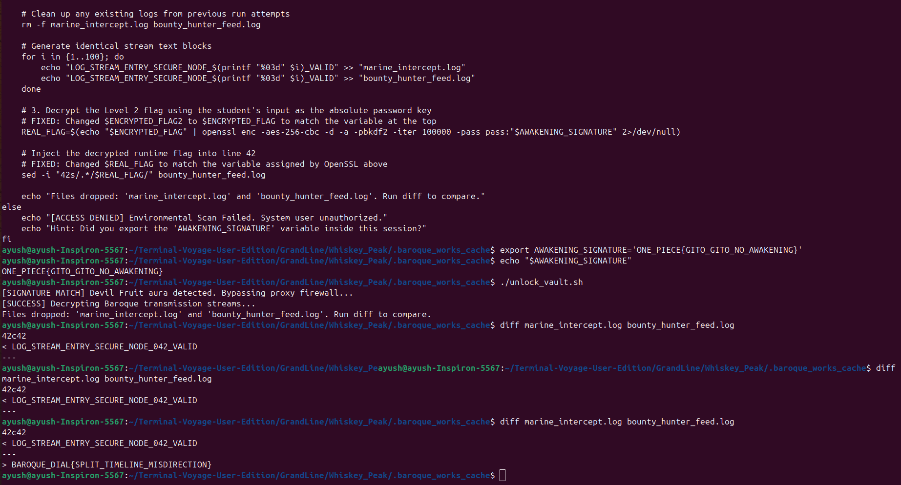
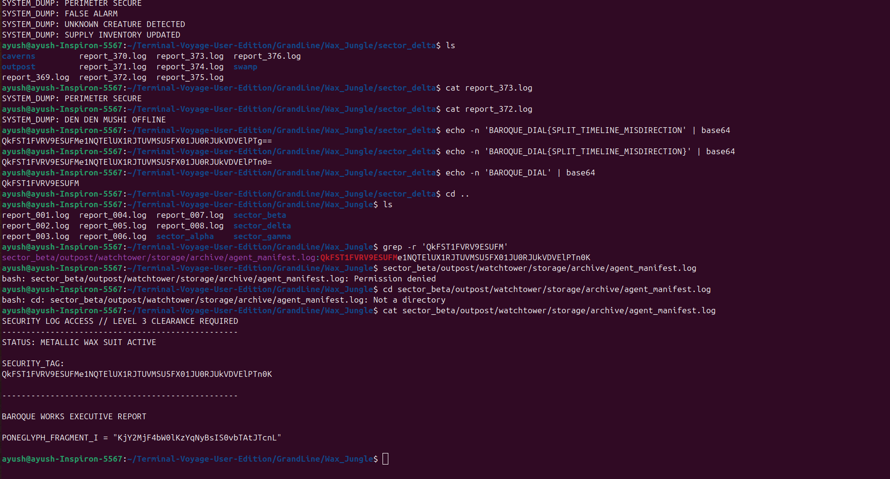
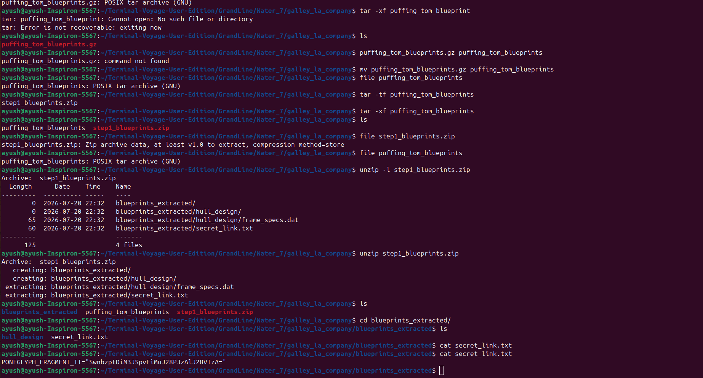
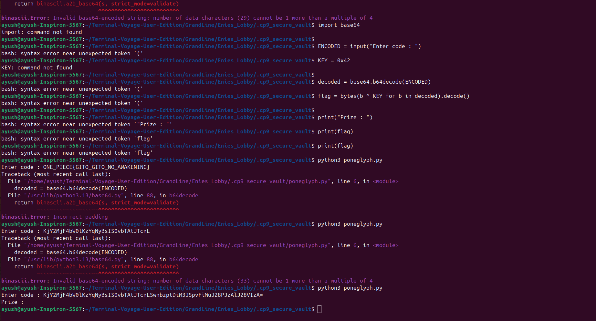
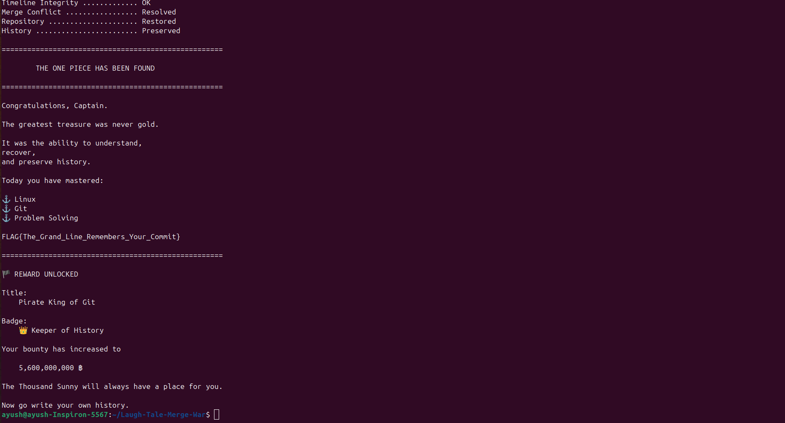

TERMINAL VOYAGE LOGBOOK

LEVEL 1 - Loguetown Reef
Objective: Finding the genuine Devil Fruit.
Commands Used : find sector_* -type f -executable
In this level the hidden devil fruit was hidden in any of the given 4 sections, so I used find command to find that. With type -f I made sure that it is a regular file and with -exectuable that it is an execuatble file, cuz we know  this is the only executable file which we latter execute by ./eat.sh script : ./eat.sh sector_C/devil_fruit_6.txt .

Devil fruit location :sector_C/devil_fruit_6.txt

Awakening Signture/Key : ONE_PIECE{GITO_GITO_NO_AWAKENING}

LEVEL 2 — THE TWO FACES OF WHISKEY PEAK
Objective : Finding Key/Boroque Dial

Inside the Whiskey_Peak folder I ran git branch -a to find if there's any other branch as suggested in the hint, now unsprisingly enough there was one called  Whiskey_peak_investigation. Now this branch isn't save on my local server so i simply ran git switch whiskey_peak_investigation. Now using ls -a I looked which all hidden content are present there in this branch, I got .boroque_works_cache from there which I cat to read its content. Then from the code i found out you have to write the key of the previos level in AWAKENING_SIGNATURE. I wrote " export AWAKENING_SIGNATURE='ONE_PIECE{GITO_GITO_NO_AWAKENING}' " to store the value of AWAKENING_SIGNATURE. As suggested in the code, I ran diff marine_intercept.log bounty_hunter_feed.log command to compare, finally getting the key.

Awakening Signture/Key : BAROQUE_DIAL{SPLIT_TIMELINE_MISDIRECTION}

LEVEL 3 — THE WAX LABYRINTH OF LITTLE GARDEN

Objective: find the first cypher fragment

Started with switching the branch to little_garden by git switch little_garden, now throught the Grandline go to Wax_Jungle/ so many records are kept there. Convert the key from previous level to base64 code using echo -n 'BAROQUE_DIAL{SPLIT_TIMELINE_MISDIRECTION}' | base64 command..... now using grep -r 'QkFST1FVRV9ESUFM' found the similiar text in any of the text which was found in sector_beta/outpost/watchtower/storage/archive/agent_manifest.log.....using cat command finally found the first cypher fragement.

PONEGLYPH_FRAGMENT_I = "KjY2MjF4bW0lKzYqNyBsIS0vbTAtJTcnL"

LEVEL 4 — THE CAMOUFLAGED BLUEPRINTS OF WATER 7
Objective: Find the second cypher fragment.
In the branch canonical-timeline there's a a Directory GrandLine--> Water_7-- > galley_la_company inside it there is puffing_tom_blueprints. I checked the file type using file puffing_tom_blueprints. It was written "gzip compressed data, was "step2_blueprints.tar" so apparently an original .tar file compressed into .gz
. Now change the file name to the correct extension of .gz using mv comand. Now by gunzip puffing_tom_blueprints.gz command i unzipped the comprssed file. After which I got puffing_tom_blueprints, checked the file type again and got POSIX which is basically .tar. Use tar -xf puffing_tom_blueprints command to execute the file which got me a step1_blueprints.zip file which i unzipped using unzip -l step1_blueprints.zip command. After extracting got a directory blueprints_extracted, inside which there was secret_link.txt file, finally cat it and got the second cypher fragement.

PONEGLYPH_FRAGMENT_II="SwnbzptDiM3JSpvFiMuJ28PJzAlJ28VIzA="

LEVEL 5 — THE BUSTER CALL TIMELINE RECOVERY
Objective: Find the adress of the LEVEL 6.

Hop into alternate_timeline branch and checked the git log. Level 5 : Vault sealed, that was the last existing copy of vault before getting deleted. USing git switch --detach d4e7bf5, went to that stage then found a hidden directory .cp9_secure_vault and inside it there was a python file. Executed the file using command python3 poneglyph.py and entered the code as the merge key of both fragment I and fragment II. Found the prize as the repo link of LEVEL 6.

Prize : https://github.com/rogueone-x/Laugh-Tale-Merge-War

Level - 6 — THE GREAT MERGE WAR AT LAUGH TALE

Objective: Find the final flag and become the Pirate King of Git.
Apparently, there are two branches here i.e ancient_history and pirate_king_path. I tried merging them but got a conflict in key_part_1.txt and key_part_2.txt solved the conflict and got the password "TheGrandLineRemembers". Then commit the change. After that I raan ./victory.sh dcript for which the pasword was what i just obtained a while ago, and I finally the One piece is found.

FLAG: FLAG{The_Grand_Line_Remembers_Your_Commit}

🏴 REWARD UNLOCKED

Title:
    Pirate King of Git

Badge:
    👑 Keeper of History

Your bounty has increased to

    5,600,000,000 ฿

The Thousand Sunny will always have a place for you.

