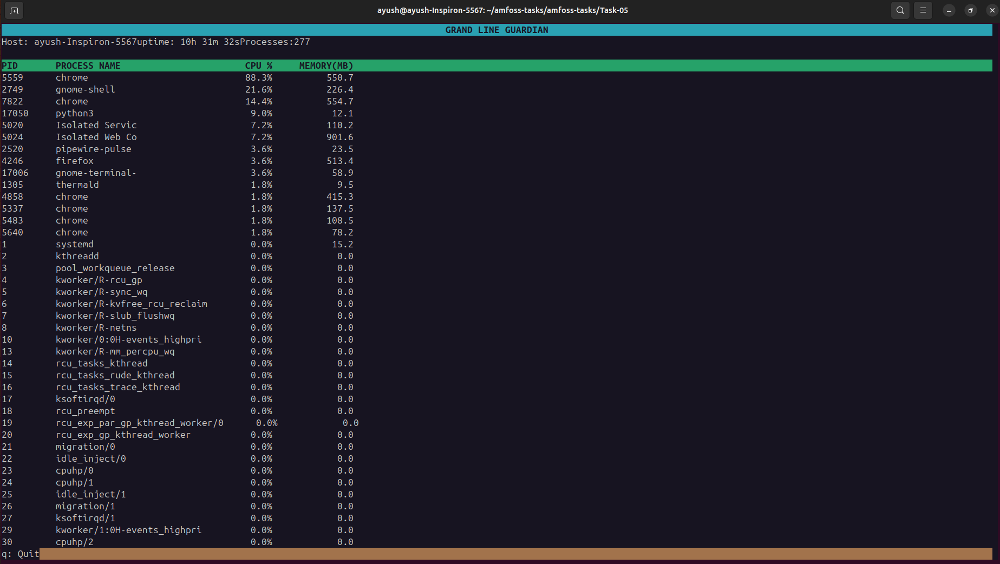

# Task 05 - Grand Line Guardian

Grand Line Guardian is a simple terminal-based Linux process monitor written in Python.

The main goal of this task was to understand how Linux stores information about running processes and how tools like `top` get values such as PID, CPU usage and memory usage.

Instead of using `psutil`, I read the required data directly from the Linux `/proc` filesystem.

---

## Features

- Shows running process IDs
- Shows process names
- Shows CPU usage
- Shows memory usage in MB
- Shows active process count
- Shows hostname and system uptime
- Sorts processes by CPU usage
- Refreshes every 0.5 seconds
- Uses a colored terminal UI with `curses`
- Press `q` to quit

---

## Where the Data Comes From

Most of the data is read directly from `/proc`.

| Information | Source |
|---|---|
| Process IDs | Numeric folders inside `/proc` |
| Process name | `/proc/<pid>/comm` |
| Memory usage | `VmRSS` inside `/proc/<pid>/status` |
| Process CPU time | `utime` and `stime` inside `/proc/<pid>/stat` |
| Total CPU time | First `cpu` line in `/proc/stat` |
| System uptime | `/proc/uptime` |
| Hostname | `os.uname().nodename` |
| Logical CPU count | `os.cpu_count()` |

CPU percentage is not directly stored in one file. I calculate it by comparing the change in process CPU time with the change in total system CPU time between two refreshes.

Because the calculation follows the usual per core style used by tools like `top`, a process can show more than `100%` CPU if it is using more than one logical CPU.

---

## How It Works

The program first finds all numeric folders inside `/proc`, because every numeric folder represents a running process.

For each PID, it reads:

- the process name
- memory usage
- process CPU time

It also reads the total CPU time of the system.

Two CPU snapshots are compared to calculate the CPU percentage for each process. The process information is then stored in dictionaries, sorted by CPU usage, and displayed using `curses`.

The screen refreshes every 500 ms.

Processes can stop while the program is reading them, so `FileNotFoundError` and `PermissionError` are handled to prevent the monitor from crashing.

---

## Running the Program

This project is Linux-only because it uses `/proc`.

Run:

```bash
python3 main.py
```

Quit using:

```text
q
```

No external Python packages are required. The program only uses Python standard library modules:

```python
import os
import curses
```

---


## Screenshot



---

## What I Learned

Through this task I learned:

- how the Linux `/proc` filesystem works
- where Linux stores process information
- how CPU percentage is calculated from CPU time
- how to handle processes that disappear while being read
- how to use dictionaries and sorting in Python
- how to build a refreshing terminal UI using `curses`
- how to use terminal colors, formatting and keyboard input

---

## Resources Used

- Linux `/proc` filesystem documentation
- Linux `top` command
- Python `os` documentation
- Python `curses` documentation
- `curses` Youtube tutorial
