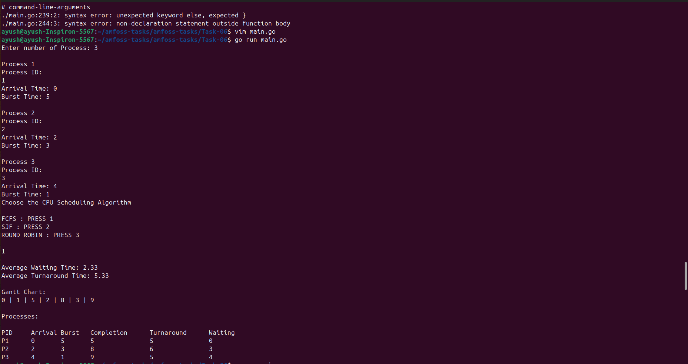
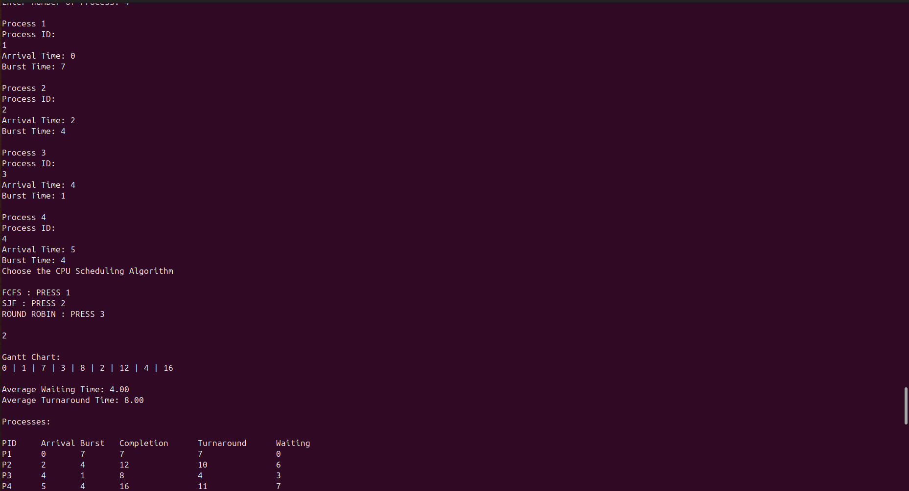
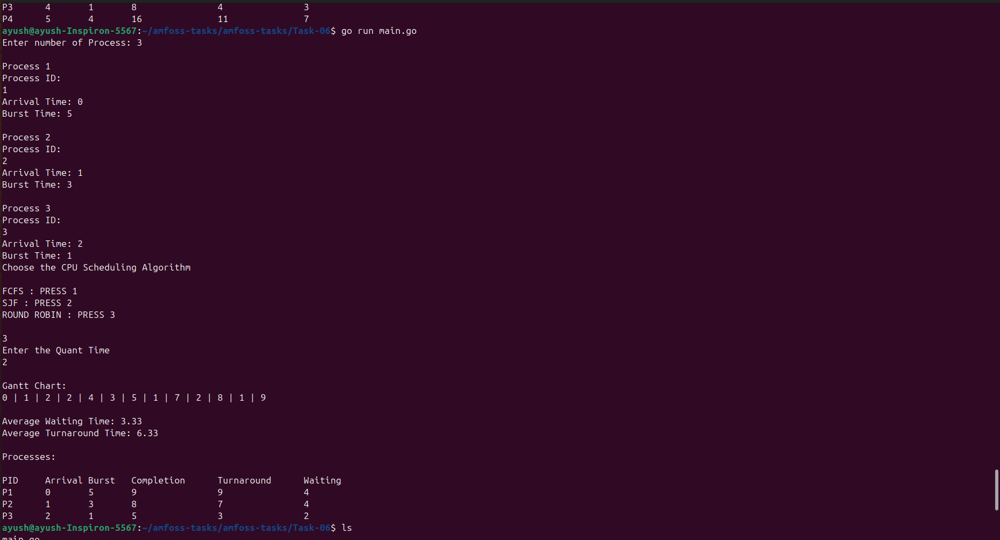

# Task 06: CPU Scheduling Simulator

## Overview

This project is a terminal based CPU Scheduler written in GOlang.

The program simulates 3 different CPU Scheduling Algorithms using processes with a process ID,Arrival Time, and Burst Time. For the Round Robin Algo we also have to provide the Quantum Time.

The simulator calculates the execution order of processes and also makes a Gantt Chart and also calculates the Average Waiting and Turnaround Time.

## Scheduling Algorithms:

I have used 3 CPU scheduling algorithms here.

### 1)First Come First Serve(FCFS)

As the name suggest it exectues a process according to the order of its arrival time. Arrive First --> execute first (executes until completion).

### 2) Shortest Job First(SJF)

It executes the proccess with the shortest burst time first and is ecextued till the completion.

> NOTE: that we have used the non-preemptive SJF scheduling.

### 3)Round Robin

This algo gives every process a fixed amount of CPU time called Quantum Time. If a process does not finish within its Quant Time, then it is placed in the ready queue and gets another chance later on, in the meanwhile the next process executes(executes till the Quant Time).

## Features:

* Accepts Process ID
* Accepts Arrival Time
* Accepts Burst Time
* Accepts Time Quantum for Round Robin
* Supports FCFS scheduling
* Supports SJF scheduling
* Supports Round Robin scheduling
* Displays a Gantt Chart / execution timeline
* Calculates Completion Time
* Calculates Turnaround Time
* Calculates Waiting Time
* Calculates Average Waiting Time
* Calculates Average Turnaround Time
* Displays all results directly in the terminal

## Calculations:

```text
Turnaround Time = Completion Time - Arrival Time
Waiting Time = Turnaround Time - Burst Time
Average Waiting time = Total Waiting Time / Number of Process
Average Turnaround time = Total Turnaround Time / Number of Process
```

## Approach:

I used a "Process" struct to store the details of each process including its Process ID,Arrival Time, Burst Time, Completion Time, Turnaround Time and Waiting Time.

* For FCFS, The processes are simply sorted by their Arrival Time and executed one after another.
* For SJF, First check all the process which has arrived at the current Time and executes the unfinished process with the smallest Burst Time.
* For Round Robin, a queue is used to maintain the order of ready processes. Each process executes only the time which Quant Time allows, if the Burst time is still remaining, it(the process) is added back to the queue.

The current CPU time is tracked during the simulation and is also used to generate the Gantt Chart.

## Running the program:

Make sure GO is installed.

Check using:

```bash
go version
```

Navigate to the Task-06 directory and run:

```bash
go run main.go
```

The program will first ask the number of processes and their details.

After entering the processes,select one of the CPU scheduling Algorithms.

```text
FCFS : PRESS 1 
SJF : PRESS 2 
ROUND ROBIN : PRESS 3
```

For Round Robin, You will additionally be asked for the Quant Time input.

## Examples:

### FCFS



### SJF



### Round Robin



## Resources Used:

### 1)For learning CPU scheduling Algorithms:

https://www.youtube.com/watch?v=pPAKs7tT8sw

### 2)For learning GO:

https://www.youtube.com/watch?v=v2wNFqOilmU

https://go.dev/tour/list

## Conclusion:

This task helped me to understand 3 different types of CPU scheduling algorithms and how they actually work by implemenring them manually instead of just studying them theoritically.

It was also my introduction to a new language "GO", I learnt many concepts like structs,sorting, queues and terminal based program execution.

